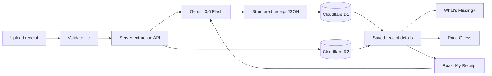

# Receiptly 🎯

## Basic Details

### Team Name: Receiptly

### Team Members

- Team Lead: Akshaj Dev — [SNGCET]
 

### Project Description

`Receiptly` is an AI-powered receipt scanner that converts photos and PDFs into structured purchase data. It extracts merchant details, totals, taxes, payment information, and line items, then saves the original receipt alongside its data. Users can revisit receipts, play games using their actual purchases, or ask Gemini to roast their shopping decisions.

### The Problem (that doesn't exist)

Receipts are far too comfortable being boring pieces of paper. They sit in pockets, fade into unreadable hieroglyphics, and contribute absolutely nothing to entertainment—while still expecting us to manually type every number into a spreadsheet.

### The Solution (that nobody asked for)

Upload the evidence and let `Receiptly` interrogate it. Gemini turns the receipt into clean data, the archive keeps it safe, **What’s Missing?** tests your shopping memory, **Price Guess** checks whether you noticed the bill, and **Roast My Receipt** delivers the sarcastic financial commentary nobody requested.

## Technical Details

### Technologies/Components Used

For Software:

- Languages: TypeScript, TSX, CSS, SQL
- Frameworks: React 19, Next.js 16, Vinext, Vite
- UI libraries: Tailwind CSS, Radix UI, Lucide React
- Validation and data: Zod, Drizzle ORM
- AI: Google Gemini API using `gemini-3.6-flash`
- Storage: Cloudflare D1 for structured receipt data and Cloudflare R2 for receipt images and PDFs
- Runtime: Cloudflare Workers-compatible server runtime
- Tools: Node.js, npm, Git, ESLint, Wrangler

For Hardware:

- Any computer or phone with a modern web browser
- Optional phone camera or scanner for capturing receipts
- No dedicated electronic hardware is required

### Implementation

The browser accepts JPG, PNG, WebP, and PDF receipts up to 10 MB. A server-side API sends the receipt to Gemini with a strict JSON response schema, keeping the API key out of the browser. The extracted metadata is saved in D1 while the original file is saved in R2. Individual receipt APIs retrieve the complete record and image for the archive.

The two games run entirely in the browser using saved receipt data and never modify the original records. **What’s Missing?** builds answer choices from real stored item names, while **Price Guess** dynamically creates nearby currency-aware prices. **Roast My Receipt** uses a server-side Gemini request containing only item names, quantities, prices, currency, and total, with explicit safe-humor rules.

### Installation

```bash
git clone <your-repository-url>
cd recieptexe
npm install
cp .env.example .env.local
```

Create a key in [Google AI Studio](https://aistudio.google.com/app/apikey), then add it to `.env.local`:

```env
GEMINI_API_KEY=your_gemini_api_key_here
```

Never commit `.env.local` or expose the key in browser code.

### Run

```bash
npm run dev
```

Open [http://localhost:5173](http://localhost:5173).

To verify a production build:

```bash
npm run build
```

## Project Documentation

### Screenshots


*The responsive upload workspace where users can drag and drop a receipt image or PDF for extraction.*


*An archived receipt showing its original image, merchant information, totals, payment details, and extracted line items.*


*The terminal-inspired games and Roast My Receipt experiences powered by the selected receipt’s actual data.*

> Add these three screenshots to `docs/screenshots/` before submission.

### Diagrams



*The receipt is processed on the server, structured data is stored in D1, and the original file is stored in R2. Saved data powers receipt details, local games, and the server-side roast feature.*

## Hardware Documentation

### Schematic & Circuit

Not applicable—`Receiptly` is a software-only project and requires no custom circuit.

### Build Photos

Not applicable. The project runs on a standard computer or phone through a web browser.

## Project Demo

### Video

[Add your demo video link here]

*The video should demonstrate uploading and extracting a receipt, opening it from the archive, playing both receipt games, and generating a receipt roast.*

### Additional Demos

- Local application: `http://localhost:5173`
- Live deployment: [Add deployed application link]
- Source code: [Add GitHub repository link]

## Team Contributions

- Akshaj Dev: Product concept, interface design, receipt extraction, persistent storage, receipt archive, games, roast feature, and testing
 

---

Made with ❤️ at TinkerHub Useless Projects

[](https://www.tinkerhub.org/)
[](https://tinkerhub.org/events/1M8ORET9A1/useless-projects-3.0)
